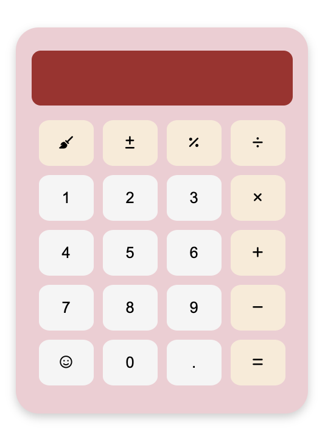

## 📌 Commit Convention

| 타입       | 설명                                |
| ---------- | ----------------------------------- |
| `feat`     | 새로운 기능 추가                    |
| `fix`      | 버그 수정                           |
| `docs`     | 문서 내용 수정                      |
| `refactor` | 코드를 리펙토링 - 가독성, 구조 향상 |
| `test`     | test 관련 코드 추가, 수정           |
| `chore`    | (코드 수정 없이) 설정 변경          |
| `design`   | 사용자 UI 디자인 변경               |
| `rename`   | 파일/폴더명 수정                    |
| `remove`   | 파일 삭제                           |

## MiniCalculator - 사칙연산 계산기

- HTML, CSS, JavaScript로 사칙연산이 가능한 계산기를 만들어 보았습니다.

### 유의사항

- ±, %, 스마일 버튼은 작동되지 않습니다.
- 빗자루 모양은 AC 버튼입니다.

### 참고 이미지

